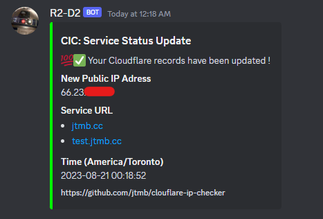

<h1 align="center">
  <a href="https://github.com/jtmb">
    
  </a>
</h1>

<div align="center">
  <b>Cloudflare IP Checker</b> - Keep your Cloudflare proxy records automatically updated!
  <br />
  <br />
  <a href="https://github.com/jtmb/ip_check/issues/new?assignees=&labels=bug&title=bug%3A+">Report a Bug</a>
  ·
  <a href="https://github.com/jtmb/ip_check/issues/new?assignees=&labels=enhancement&template=02_FEATURE_REQUEST.md&title=feat%3A+">Request a Feature</a>
  .
  <a href="https://hub.docker.com/repository/docker/jtmb92/cloudflare_ip_checker/general">Docker Hub</a>
</div>
<br>
<details open="open">
<summary>Table of Contents</summary>

- [About](#about)
    - [Highlighted Features](#highlighted-features)
- [Prerequisites](#prerequisites)
- [Getting Started](#getting-started)
    - [Docker Image](#docker-image)
    - [Running on Docker](#running-on-docker)
    - [Running on Docker Compose](#running-on-docker-compose)
    - [Running on Docker Swarm](#running-on-docker-swarm)
- [Environment Variables Explained](#environment-variables-explained)
- [Contributing](#contributing)
- [License](#license)

</details>
<br>

---

### <h1>About</h1>

An Alpine-based microservice within Docker, designed to seamlessly manage and update Cloudflare records whenever a change is detected in your publicly-facing IP address.

This solution proves invaluable for those who self-host using a dynamic IP address, ensuring the uninterrupted integrity of their Cloudflare DNS records.

### Highlighted Features:

- <b>Streamlined addition of monitored A records</b> in cases of accidental removal.
- <b>Automatic identification of changes in the forward-facing IP</b> facilitating the prompt update of A records with the new IP address.
- <b>User-friendly customization</b> achieved through a concise set of environment variables.
- <b>Integration with Discord</b> for simple alert notifications.
- <b>Fast</b> - API request total time on average is less than a second.
- <b>Lightweight</b> - Alpine Container keeps the image size below 15 MB.
- <b>Scalable</b> - Built with scale in mind, Docker Swarm compatible.

#### Example:


#### Discord Alerting:



## Prerequisites

- Docker installed on your system
- A Discord webhook URL
- A Cloudflare API Key
- The ZONE ID for your Cloudflare instance

### <h2>Getting Started</h2>
### [Docker Image](https://hub.docker.com/r/jtmb92/cloudflare_ip_checker)
```docker
 docker pull jtmb92/cloudflare-ip-checker
```
### Running on docker
A simple docker run command gets your instance running.
```docker
docker run --name ip-checker-container \
    -e EMAIL="your-email@example.com" \
    -e API_KEY="your-cloudflare-api-key" \
    -e ZONE_ID="your-cloudflare-zone-id" \
    -e WEBHOOK_URL="your-discord-webhook-url" \
    -e DNS_RECORDS="my.site.com/A site.com/A" \
    -e REQUEST_TIME=120 \
jtmb92/cloudflare-ip-checker
```
### Running on docker-compose
Run on Docker Compose (this is the recommended way) by running the command "docker compose up -d".
```yaml
version: '3.8'
services:
    ip-checker:
        image: jtmb92/cloudflare-ip-checker
        volumes:
         - /path/to/logs:/data/logs 
        environment:
            EMAIL: 'your-email@example.com'
            API_KEY: 'your-cloudflare-api-key'
            ZONE_ID: 'your-cloudflare-zone-id'
            WEBHOOK_URL: 'your-discord-webhook-url'
            DNS_RECORDS: 'my.site.com/A site.com/A'
            REQUEST_TIME: '2m'
```

### Running on docker-compose with custom dockerfile
Similar to the above example, the key difference here is that we are running with the build: argument instead of the image: argument. The . essentially builds the Docker image from a local Dockerfile located in the root directory where the docker compose up -d command was run.
```yaml
version: '3.8'
services:
    ip-checker:
        build: .
        volumes:
         - /path/to/logs:/data/logs 
        environment:
            EMAIL: 'your-email@example.com'
            API_KEY: 'your-cloudflare-api-key'
            ZONE_ID: 'your-cloudflare-zone-id'
            WEBHOOK_URL: 'your-discord-webhook-url'
            DNS_RECORDS: 'my.site.com/A site.com/A'
            REQUEST_TIME: '120'
```
### Running on swarm
**Meant for advanced users**
Here's an example using the Loki driver to ingress logging over a custom Docker network while securely passing in ENV vars.
```yaml
version: "3.8"
services:
    cloudflare-ip-checker:
        image: "jtmb92/cloudflare_ip_checker"
        restart: always
        networks:
            - container-swarm-network
        volumes:
         - /path/to/logs:/data/logs 
        environment:
            API_KEY:  ${cf_key}
            ZONE_ID: ${cf_zone_id}
            WEBHOOK_URL: ${discord_webook}
            DNS_RECORDS: 'my.site.com/A site.com/A'
            REQUEST_TIME: "2m"
            EMAIL: ${email}
        deploy:
            replicas: 1
            placement:
                max_replicas_per_node: 1
        logging:
            driver: loki
            options:
                loki-url: "http://localhost:3100/loki/api/v1/push"
                loki-retries: "5"
                loki-batch-size: "400"
networks:
    container-swarm-network:
     external: true
```

jtmb92/cloudflare_ip_checker

## Environment Variables explained

```yaml
    EMAIL: 'your-email@example.com'
```  
Your Cloudflare account email address. This is used to authenticate with the Cloudflare API.
```yaml
    API_KEY: 'your-cloudflare-api-key'
```     
Your Cloudflare API key. This key is required for making authenticated requests to the Cloudflare API.
```yaml
    ZONE_ID: 'your-cloudflare-zome-id'
```      
The ID of the Cloudflare DNS zone where your records are managed. This identifies the specific zone to update.
```yaml
    WEBHOOK_URL: 'https://discord.com/api/webhooks/<redacted>/<redacted>'
```     
The URL of your Discord webhook. This is where notifications will be sent when IP changes are detected.
```yaml
    DNS_RECORDS: 'my.site.com/A site.com/A' #example of multiple list format entries
```      
A space-separated list of Cloudflare DNS records in the format "name/type". These records will be checked and updated if necessary.
```yaml
    REQUEST_TIME: '10' #amount of time in seconds between next set of API requests. 
    REQUEST_TIME: '2m'  #amount of time in minutes between next set of API requests. 
    REQUEST_TIME: '1h'  #amount of time in hours between next set of API requests. 
    REQUEST_TIME: '1d'  #amount of time in days between next set of API requests. 
```    
The time to wait between IP checks. This determines the interval at which the script checks for IP changes.

- ** <b>Make sure to provide the appropriate values for these variables when running the Docker container. This information is crucial for the script to function correctly.</b>

## Contributing

First off, thanks for taking the time to contribute! Contributions are what makes the open-source community such an amazing place to learn, inspire, and create. Any contributions you make will benefit everybody else and are **greatly appreciated**.

Please try to create bug reports that are:

- _Reproducible._ Include steps to reproduce the problem.
- _Specific._ Include as much detail as possible: which version, what environment, etc.
- _Unique._ Do not duplicate existing opened issues.
- _Scoped to a Single Bug._ One bug per report.

## License

This project is licensed under the **GNU GENERAL PUBLIC LICENSE v3**. Feel free to edit and distribute this template as you like.

See [LICENSE](LICENSE) for more information.

